## Best Subset Selection for PCA on real data set 

In this short vignette, we present an illustration of best subset
selection for the PCA model. We use a freely available dataset from
package. The dataset contains the expression of 48 known human ABC
transporters with patterns of drug activity in 60 diverse cancer cell
lines (the NCI-60) used by the National Cancer Institute to screen for
anticancer activity.

``` r
library(mixOmics)
data(multidrug)
X <- multidrug$ABC.trans
dim(X)
```

    ## [1] 60 48

``` r
sum(is.na(X)) 
```

    ## [1] 1

-   One missig value is imputed via

``` r
X.nipals <- impute.nipals(X, ncomp = 10)
```

-   We first run a `Full` PCA model with 10 components

``` r
pca.full <- pca(X.nipals, ncomp = 10, center = TRUE, scale = TRUE)
plot(pca.full)
```

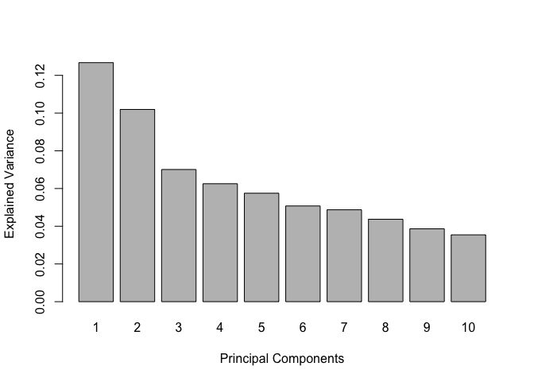

``` r
#pdf("../Latex/scree_plot.pdf",width=15)
#plot(pca.full)
#dev.off()
```

Based on the scree plot, we decide to use 3 principal componet which
explained 29.9% of the variance of the data.

``` r
pca.full$prop_expl_var$X[1:5]
```

    ##        PC1        PC2        PC3        PC4        PC5 
    ## 0.12673502 0.10192241 0.07009020 0.06254177 0.05750413

``` r
pca.full$cum.var[1:5]
```

    ##       PC1       PC2       PC3       PC4       PC5 
    ## 0.1267350 0.2286574 0.2987476 0.3612894 0.4187935

``` r
final.pca.multi <- pca(X.nipals, ncomp = 3, center = TRUE, scale = TRUE)
```

## BSS for PCA

The functions for Best Subset Selection are stored in
`Code_PCA_function.R`

-   We scale the data first and retrieve the first PC (variate) from the
    full PCA. We will use this variate for comparison with sparse PC
    given by best subset selection.

``` r
X <- scale(X.nipals)
n <- dim(X)[1]
res.PCA <- svd(crossprod(X,X)/n)
variate.F.PCA <- X%*%res.PCA$v
```

-   One can check that this variate is the same as the one given by the
    *pca* function from

``` r
cbind(pca.full$variates$X[1:10,1],variate.F.PCA[1:10,1])
```

    ##         [,1]      [,2]
    ## 1  -2.011972 -2.011972
    ## 2  -1.962327 -1.962327
    ## 3   3.273196  3.273196
    ## 4  -2.816868 -2.816868
    ## 5  -2.867318 -2.867318
    ## 6   3.715950  3.715950
    ## 7   5.157595  5.157595
    ## 8   3.779133  3.779133
    ## 9   1.575140  1.575140
    ## 10 -1.199774 -1.199774

The function **PCA.Lambda.Grid()** runs BSS for PCA model for a grid of
lambda values such that subset size from 1 to **Kmax** are visited. The
main parameters are:

-   Nlammax the budget of tuning parameter for exploring a large number
    of subset size (see our submitted paper for more details)

-   Kmax gives the maximum subset size you desire for outputs. For
    example, by choosing **Kmax=10**, best subset is given for subset
    size from **k=1 to 10**.

-   *X* your data matrix. We suggest to scale it first.

``` r
result.cPCA <- PCA.Lambda.Grid.adapt(Nlammax=30,Kmax=10,X,tau=0.5,Niter=1000,alpha=0.005,psy=c(0.9,0.999),epoch=10,tol=0.0001,t0=NULL,collect=1,Kchoice=NULL)
  #cpls_list <- organize_list(result.cPLS$best.subset,10)
```

Results of the different best subset according model size are reported
in terms of PEV (percentage of variance explained) and also correlation
of sparse PC and non-sparse PC.

``` r
#library(xtable)
cPCA.1 <- stat.CPEV(result.cPCA,deflat.mat=NULL,data=X,variate.F.PCA,mat.v=NULL,mat.u=NULL,ncomp=1)
head(cPCA.1[,c(1,2,3,4,5)],20) -> tab
#tab <- xtable(tab,digits = c(0,0,5,2,2,2),caption = "Best Subset results for component 1")
#print(tab, include.rownames=FALSE,caption.placement = "top")
tab
```

    ##       Dimension Objective fct PEV(sparse)   CPEV cor(sPC,PC)
    ##  [1,]         1   -0.01638889       2.083  2.083  -0.6150168
    ##  [2,]         2   -0.03030736       3.853  3.853   0.4123089
    ##  [3,]         3   -0.03592932       4.567  4.567   0.8160680
    ##  [4,]         4   -0.04360117       5.543  5.543   0.8393677
    ##  [5,]         5   -0.04979127       6.329  6.329   0.8573806
    ##  [6,]         6   -0.05461686       6.943  6.943   0.8744391
    ##  [7,]         7   -0.05906060       7.508  7.508   0.8751415
    ##  [8,]         8   -0.06487680       8.247  8.247   0.8802764
    ##  [9,]         9   -0.07024964       8.930  8.930   0.8499055
    ## [10,]        10   -0.07418064       9.430  9.430   0.8749101
    ## [11,]        11   -0.07689614       9.775  9.775   0.8552173
    ## [12,]        12   -0.07903101      10.050 10.050   0.8711993
    ## [13,]        13   -0.08096199      10.290 10.290   0.8554510
    ## [14,]        14   -0.08274006      10.520 10.520   0.8596309
    ## [15,]        15   -0.08355552      10.620 10.620   0.8546105
    ## [16,]        16   -0.08472535      10.770 10.770   0.8833757
    ## [17,]        17   -0.08514800      10.820 10.820   0.8980297
    ## [18,]        18   -0.08661824      11.010 11.010   0.9377825
    ## [19,]        19   -0.08802702      11.190 11.190   0.9496809
    ## [20,]        20   -0.08910206      11.330 11.330   0.9379998


# Visualisation of the best subset for the first component

-   we plot the result for subset size from 1 to 20

``` r
plot.best.subset.PCA(result.cPCA,K=20,name.var = TRUE)
```

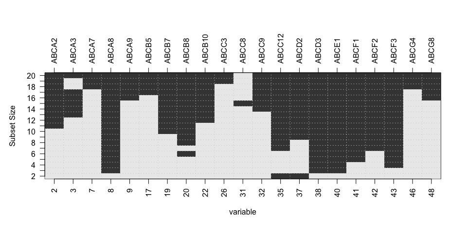

# Suggestion to choose the best subset size *k*:

    -  Choice best subset according drop in PEV or
    - \% of commun PEV between sparse Comp and non-sparse Comp

-   Choice 1:

``` r
PEV.1 <- 85
model.size.PC1 <- which.min(cPCA.1[,3]/pca.full$cum.var[1]<PEV.1)
model.size.PC1
```

    ## [1] 17

-   Choice 2:

``` r
drop <- 0.10
result.CPEV1 <- plot.CPEV(cPCA.1,data=X,drop=drop)
result.CPEV1$plot
```

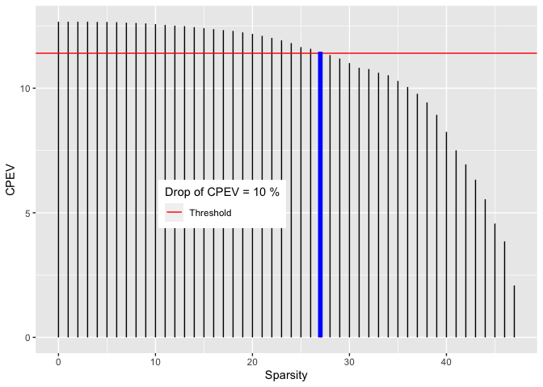

``` r
result.CPEV1$model.size
```

    ## [1] 20

``` r
#pdf("../Latex/CPEV_plot1.pdf",width = 12)
#result.CPEV1$plot
#dev.off()
```

## Deflation step with subset= model.size.PC1

In order to define the second PC, we use a deflation step using the PC1
previously chosen.

``` r
subset <- na.omit(cPCA.1[model.size.PC1,-c(1:5)])
Deflat <- Deflation.step(subset,X,data=X)
```

-   We can run our algorithm on this deflated matrix

``` r
result.cPCA2  <- PCA.Lambda.Grid.adapt(Nlammax=30,Kmax=10,Deflat$Xd,tau=0.5,Niter=1000,alpha=0.005,psy=c(0.9,0.999),epoch=10,tol=0.0001,t0=NULL,Kchoice=NULL) 
```

-   Some results are presented:

``` r
cPCA.2 <- stat.CPEV(result.cPCA2,deflat.mat = Deflat$Xd,data=X,variate.F.PCA,mat.v=Deflat$loading,mat.u=Deflat$variates,ncomp=2)
head(cPCA.2[,1:5],20)->tab
tab
```

    ##       Dimension Objective fct PEV(sparse)  CPEV cor(sPC,PC)
    ##  [1,]         1   -0.01630825       2.083 12.91   0.4560860
    ##  [2,]         2   -0.02640821       3.416 14.24  -0.1447633
    ##  [3,]         3   -0.03284752       4.335 15.05   0.6542285
    ##  [4,]         4   -0.03839653       4.903 15.71   0.7372192
    ##  [5,]         5   -0.04435537       5.666 16.47   0.7829456
    ##  [6,]         6   -0.04731717       6.020 16.86   0.8451319
    ##  [7,]         7   -0.05067799       6.574 17.40   0.8934863
    ##  [8,]         8   -0.05368466       6.967 17.78   0.9036403
    ##  [9,]         9   -0.05684955       7.366 18.21   0.9084416
    ## [10,]        10   -0.05945467       7.634 18.55   0.9019731
    ## [11,]        11   -0.06168533       7.884 18.87   0.8952680
    ## [12,]        12   -0.06372414       8.161 19.12   0.9029807
    ## [13,]        13   -0.06554445       8.373 19.36   0.8978007
    ## [14,]        14   -0.06697334       8.607 19.62  -0.9116947
    ## [15,]        15   -0.06833673       8.706 19.67  -0.8923713
    ## [16,]        16   -0.06963880       8.871 19.84  -0.8853706
    ## [17,]        17   -0.07065198       8.991 19.98  -0.8861414
    ## [18,]        18   -0.07148466       9.097 20.08  -0.8938124
    ## [19,]        19   -0.07231736       9.203 20.19  -0.8980863
    ## [20,]        20   -0.07342970       9.350 20.32  -0.9059165

``` r
#tab <- xtable(tab,digits = c(0,0,5,2,2,2),caption = "Best Subset results for component 2")
#print(tab, include.rownames=FALSE,caption.placement = "top")
```

## Visualisation of the best subset for the second component

-   we plot the result for subset size from 1 to 20

``` r
plot.best.subset.PCA(result.cPCA2,K=20,name.var = TRUE)
```

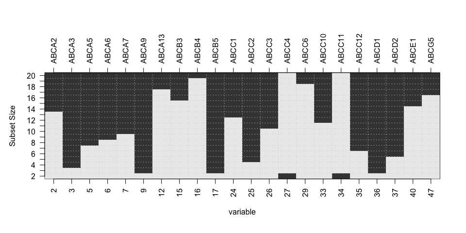

## Choice best subset according drop in PEV

``` r
drop <- 0.1
result.CPEV2 <- plot.CPEV(cPCA.2,data=X,drop=drop)
result.CPEV2$plot
```

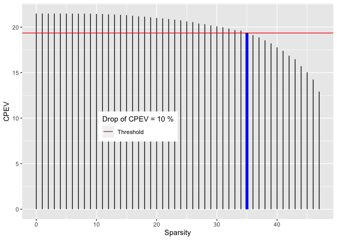

``` r
model.size.PC2 <- result.CPEV2$model.size
#pdf("../Latex/CPEV_plot2.pdf",width = 12)
#result.CPEV2$plot
#dev.off()
```

-   Deflation step with subset= model.size.PC2

``` r
subset <- na.omit(cPCA.2[model.size.PC2,-c(1:5)])
Deflat1 <- Deflation.step(subset,Deflat$Xd,data=X)
```

``` r
result.cPCA3  <- PCA.Lambda.Grid.adapt(Nlammax=30,Kmax=10,Deflat1$Xd,tau=0.5,Niter=1000,alpha=0.005,psy=c(0.9,0.999),epoch=10,tol=0.0001,t0=NULL) 
```

We collect loading vectors and variates from previous step

``` r
mat.v <- cbind(Deflat$loading,Deflat1$loading)
mat.u <- cbind(Deflat$variates,Deflat1$variates)
cPCA.3 <- stat.CPEV(result.cPCA3,deflat.mat = Deflat1$Xd,data=X,variate.F.PCA,mat.v=mat.v,mat.u=mat.u,ncomp=3)
head(cPCA.3[,1:5],20)->tab
tab
```

    ##       Dimension Objective fct PEV(sparse)  CPEV cor(sPC,PC)
    ##  [1,]         1   -0.01617413       2.083 21.20 -0.01445782
    ##  [2,]         2   -0.02622479       3.416 22.53 -0.59946589
    ##  [3,]         3   -0.03016063       3.924 23.04  0.67196525
    ##  [4,]         4   -0.03354555       4.354 23.47 -0.71528936
    ##  [5,]         5   -0.03571869       4.676 23.79 -0.76414237
    ##  [6,]         6   -0.03814169       5.009 24.13 -0.74631802
    ##  [7,]         7   -0.03961499       5.166 24.28 -0.78846110
    ##  [8,]         8   -0.04163125       5.454 24.57 -0.80587558
    ##  [9,]         9   -0.04302101       5.718 24.74 -0.80926753
    ## [10,]        10   -0.04391010       5.772 24.82 -0.83989453
    ## [11,]        11   -0.04501172       5.750 24.87 -0.94325933
    ## [12,]        12   -0.04641490       5.946 25.06 -0.95467805
    ## [13,]        13   -0.04750504       6.127 25.21  0.95945048
    ## [14,]        14   -0.04874738       6.265 25.36  0.95813554
    ## [15,]        15   -0.04998681       6.431 25.51  0.96179318
    ## [16,]        16   -0.05087938       6.572 25.65 -0.96005741
    ## [17,]        17   -0.05138024       6.577 25.70 -0.96720693
    ## [18,]        18   -0.05184400       6.625 25.75 -0.97258916
    ## [19,]        19   -0.05220717       6.668 25.81 -0.97327212
    ## [20,]        20   -0.05264038       6.715 25.86 -0.97898353

``` r
#tab <- xtable(tab,digits = c(0,0,5,2,2,2),caption = "Best Subset results for component 3")
#print(tab, include.rownames=FALSE,caption.placement = "top")
```

## Visualisation of the best subset for the third component

``` r
plot.best.subset.PCA(result.cPCA3,K=20,name.var = TRUE)
```

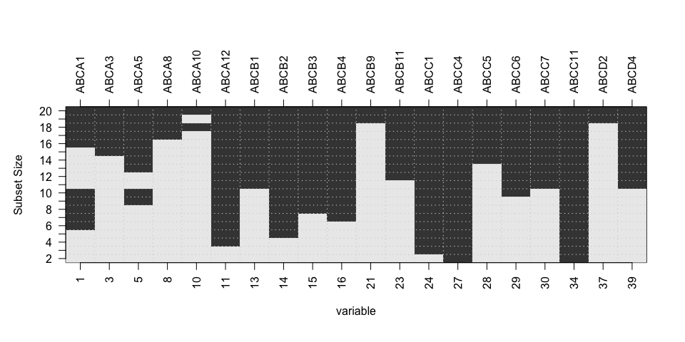

## Choice best subset according drop in PEV

``` r
drop <- 0.1
result.CPEV3 <- plot.CPEV(cPCA.3,data=X,drop=drop)
result.CPEV3$plot
```

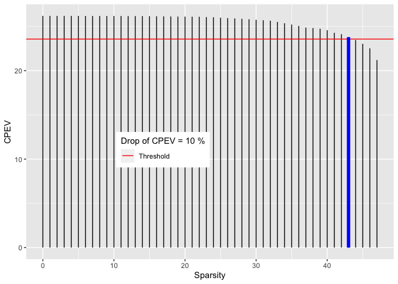

``` r
model.size.PC3 <- result.CPEV3$model.size
model.size.PC3
```

    ## [1] 4

``` r
#pdf("../Latex/CPEV_plot3.pdf",width = 12)
#result.CPEV3$plot
#dev.off()
```

``` r
subset <-na.omit(cPCA.3[model.size.PC3,-c(1:5)])
Deflat2 <- Deflation.step(subset,Deflat1$Xd,data=X)
```

## Plot result:

We exploit here *mixOmics* plot function. For this, we create an *spca*
object

``` r
mat.v <- cbind(Deflat$loading,Deflat1$loading,Deflat2$loading)
mat.u <- cbind(Deflat$variates,Deflat1$variates,Deflat2$variates)
myPCA <- final.pca.multi
prop_expl_var <- explained_variance(X, mat.u, ncomp=3)
myPCA$prop_expl_var$X <- prop_expl_var
myPCA$variates$X  <- mat.u       
myPCA$loadings$X <- mat.v 
rownames(myPCA$loadings$X) <- rownames(final.pca.multi$loadings$X)
colnames(myPCA$loadings$X) <- colnames(final.pca.multi$loadings$X)
myPCA$x <- mat.u
class(myPCA) <- c("spca","pca")
model.size <- c(model.size.PC1,model.size.PC2,model.size.PC3)
myPCA$keepX <- model.size
```

``` r
p1 <- plotIndiv(myPCA,
          comp = c(1, 2),   # Specify components to plot
          ind.names = TRUE, # Show row names of samples
          group = multidrug$cell.line$Class,
          title = 'BSS-PCA comp 1 - 2',
          legend = T, legend.title = 'Cell Type',size.legend = rel(2),size.xlabel = rel(1.5),
  size.ylabel = rel(1.5),
  size.axis = rel(1.5),cex=4,size.legend.title=rel(2))
```

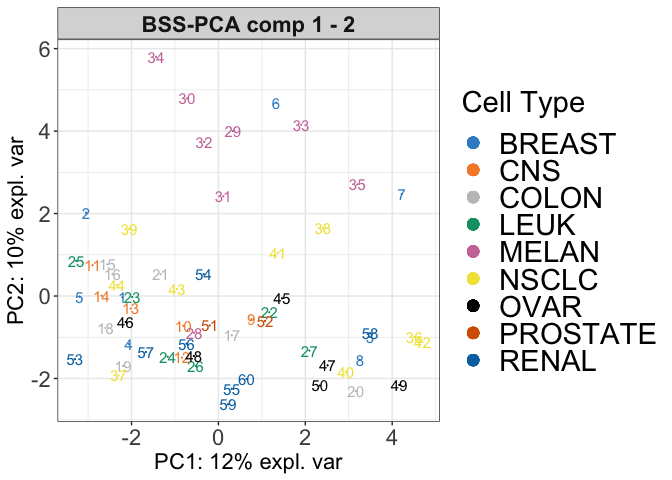

``` r
p2 <- plotIndiv(pca.full,
          comp = c(1, 2),   # Specify components to plot
          ind.names = TRUE, # Show row names of samples
          group = multidrug$cell.line$Class,
          title = 'Full PCA comp 1 - 2',
          legend = T, legend.title = 'Cell Type',size.legend = rel(2),size.xlabel = rel(1.5),
  size.ylabel = rel(1.5),
  size.axis = rel(1.5),cex=4,size.legend.title=rel(2))
```

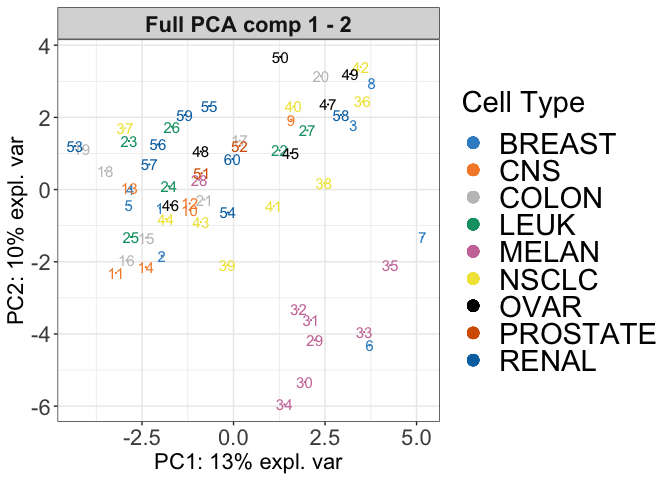

-   For saving the plot and ploting side by side

``` r
#library(ggpubr)
#ggarrange(c(p1$graph,p2$graph),ncol=2,nrow=1,common.legend = TRUE)
#pdf("../Latex/sample_plot.pdf",width = 12)
#arrange <- ggarrange(p1$graph,p2$graph,ncol=2,nrow=1,common.legend = TRUE,legend="right")
#ggsave("../Latex/sample_plot.png", arrange, width = 12, height = 6)
#dev.off()
par(mfrow=c(1,2))
p1$graph
```

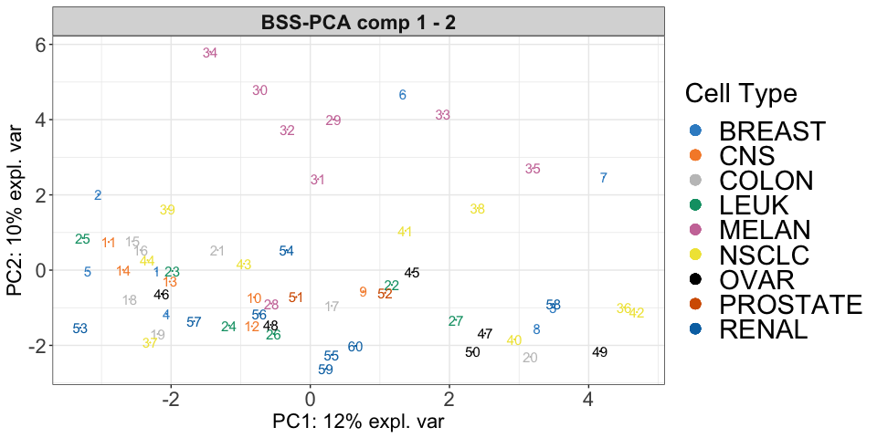

``` r
p2$graph
```

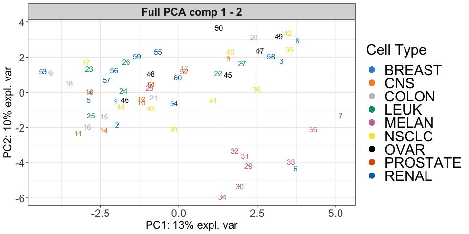
