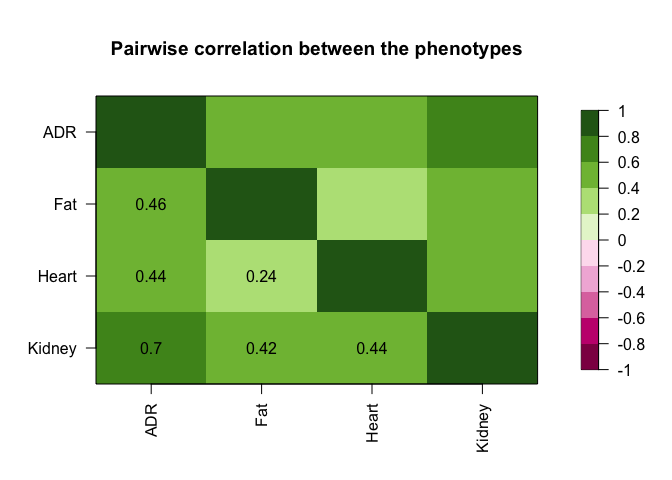
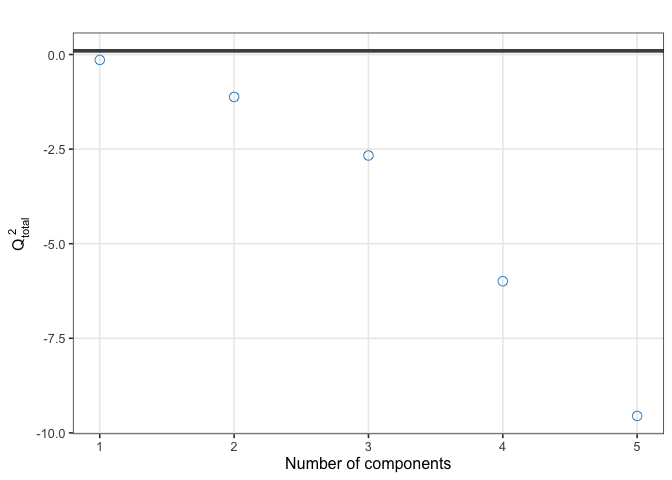
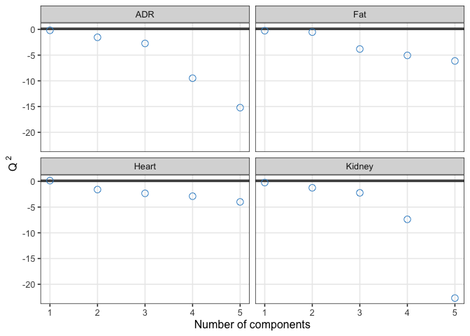
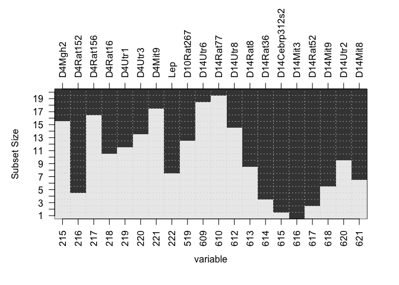
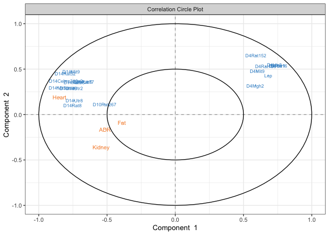

# Best Subset Secetion for PLS2 on real data set 

In this short vignette, we present an illustration of best subset
selection for the PLS2 model. We use a freely available dataset from
package. The dataset consists of 770 SNPs in 29 inbred rats as a
predictor matrix (*n* = 29,*p* = 770),and the 29 measured expression
levels in the 4 tissues as the outcome (*q* = 4).

## Loading the data

``` r
load("data.X.rda")
load("data.Y.Hopx.rda")
load("MAP.file.rda")
library(mixOmics)
library(rlist)
library(R.utils)
library(fields)
```

``` r
Y <- scale(as.matrix(data.Y.Hopx))
dim(Y)
```

    ## [1] 29  4

``` r
X <- scale(as.matrix(data.X[,]))
dim(X)
```

    ## [1]  29 770

``` r
source("Function_BSS_PLS2.R")
```

## Some descriptive statistics about the data

``` r
pairwise.correlation(data.Y.Hopx)  ## (a) Pairwise correlations among the four tissues
```



``` r
plotcim.explore(data.X, data.Y.Hopx)
```

## Choose the number of Component using Q2

``` r
tune.pls <- pls(X=data.X,Y=data.Y.Hopx[,c(1,2,3,4)],ncomp=5,mode="regression",scale=T)
set.seed(33)
Q2.pls <- perf(tune.pls,validation="loo")
#pdf(file="Q2total.pdf",width=10)
plot(Q2.pls,criterion='Q2.total')
```



``` r
#dev.off()    
#pdf(file="Q2.pdf",width=10)
plot(Q2.pls,criterion='Q2')
```



``` r
#dev.off()
```

# BSS-PLS

## BSS-PLS with adaptative grid

``` r
p <- dim(X)[2]
lambda.max<- ((1/(dim(X)[1]))*(svd(t(X)%*%Y,nu=1,nv=1)$d[1]))**2
ta <- rep(0.5,p)
result.cPLS <- PLS.Lambda.Grid(Nlammax=50,Kmax=20,X,Y,tau=0.5,Niter=1000,alpha=0.01,psy=c(0.9,0.999),epoch=10,tol=0.001,t0=ta,collect = 10,Kchoice=20) 
```

## Visualise best subset

``` r
name.var <- MAP.file[,1]
plot.best.subset.PLS(result.cPLS,20,name.var = name.var)
```



## Visualise the PLS model with a subset of size 20

-   Correlation circle plot

``` r
var.select <- result.cPLS$list.BSS[[20]]
pls.subset.20 <- pls(X[,var.select],Y,ncomp=2)
plotVar(pls.subset.20,var.names = list(name.var[var.select],colnames(Y)),cex=c(2.5,3))
```



## Comparison with sparse PLS for subset from size 1:20

-   Sparse PLS form mixOmics

``` r
p <- dim(X)[2]
n <- dim(X)[1]
kmax <- 770
spls_list <- vector(mode = "list", length = kmax)
spls.crit<- vector( length = kmax)
for(k in 1:kmax){
  model.spls <- sgPLS::sPLS(X,Y,ncomp=1,keepX=c(k))
  res.spls <- sgPLS::select.spls(model.spls)$select.X[[1]]
  spls_list[[k]] <- as.vector(res.spls)
  spls.crit[k] <- criterion(x=spls_list[[k]],m=n,data=X,Y=Y)
}
```

    - Better set with spls

``` r
sum(spls.crit[1:20]<result.cPLS$best.subset[,2])
```

    ## [1] 3

    - Better set with BSS

``` r
sum(spls.crit[1:20]>result.cPLS$best.subset[,2])
```

    ## [1] 7

    - Same set with BSS

``` r
sum(spls.crit[1:20]==result.cPLS$best.subset[,2])
```

    ## [1] 10

## Merge two runs with different initial start

``` r
ta <- rep(0.7,p)
result.cPLS.2 <- PLS.Lambda.Grid(Nlammax=50,Kmax=20,X,Y,tau=0.5,Niter=1000,alpha=0.01,psy=c(0.9,0.999),epoch=10,tol=0.001,t0=ta,collect = 1,Kchoice=20) 

result <- merge.model(result.cPLS,result.cPLS.2,X,Y)
```

## Comparison with sparse PLS for subset from size 1:p

``` r
ta <- rep(0.5,p)
result.cPLS.770 <- PLS.Lambda.Grid(Nlammax=100,Kmax=50,X,Y,tau=0.5,Niter=1000,alpha=0.01,psy=c(0.9,0.999),epoch=10,tol=0.001,t0=ta,collect = 1,Kchoice=200) 
```

``` r
ta <- rep(0.7,p)
result.cPLS.770.2 <- PLS.Lambda.Grid(Nlammax=100,Kmax=50,X,Y,tau=0.5,Niter=1000,alpha=0.01,psy=c(0.9,0.999),epoch=10,tol=0.001,t0=ta,collect = 1,Kchoice=200) 
```

``` r
result.merge <- merge.model(result.cPLS.770,result.cPLS.770.2,X,Y)
# Better set with spld
sum(spls.crit[1:200]<result.merge$best.subset[,2])
```

    ## [1] 36

``` r
# Better set with BSS
sum(spls.crit[1:200]>result.merge$best.subset[,2])
```

    ## [1] 147

``` r
# Same set with BSS
sum(spls.crit[1:200]==result.merge$best.subset[,2])
```

    ## [1] 17
